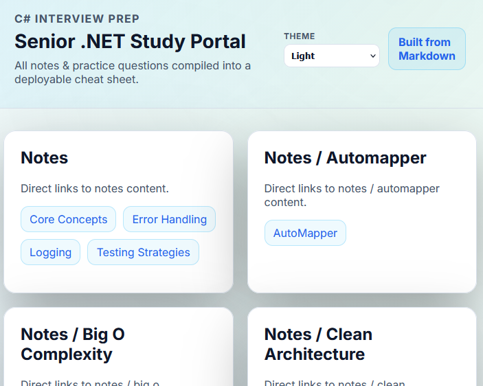

# Senior C#/.NET Interview Preparation Repository

A comprehensive study guide and resource collection for senior C#/.NET developer interviews, featuring automated build tools, interactive study sites, and flash cards.

## Live Demos

### Study Site
Interactive documentation site with detailed notes and examples.



**[View Live Study Site](https://senior-dot-net-study-portal.dloizides.com/)**

### Flash Cards
Auto-rotating Q&A cards with code examples for quick review.


**[View Live Flash Cards](https://c-sharp-flash-cards.dloizides.com/)**

### Exercises
Practice exercises for senior C#/.NET topics.


**[View Live Exercises](https://senior-dot-net-study-exercises.dloizides.com/)**
/)**


---

## Table of Contents

- [Quick Start](#quick-start)
- [Building the Sites](#building-the-sites)
- [Repository Overview](#repository-overview)
- [Study Materials](#study-materials)
- [Prerequisites](#prerequisites)
- [Testing Locally](#testing-locally)
- [Docker Support](#docker-support)

---

## Quick Start

### 1. Clone the Repository
```bash
git clone <repository-url>
cd cSharpInterviewPrep
```

### 2. Build Everything
```powershell
.\build-all.ps1
```

### 3. Start Studying
- Browse notes in [notes/](notes/)
- Review questions in [practice/](practice/)
- Follow the [prep-plan.md](prep-plan.md) for structured preparation

---

## Building the Sites

### Automated Build (Recommended)

The [build-all.ps1](build-all.ps1) script builds both the study site and flash cards in one command.

```powershell
# Run from repository root
.\build-all.ps1
```

**What it does:**
1. Builds the study site from markdown notes
2. Generates flash card data from questions
3. Reports build status for each component
4. Shows next steps for testing

**Requirements:**
- PowerShell 5.1 or later (or PowerShell Core)
- Node.js (for build scripts)

**Build Outputs:**
- Study Site: [study-site/dist/](study-site/dist/)
- Flash Cards: [flash-card-web-site/flash-card-data.js](flash-card-web-site/flash-card-data.js)

### Individual Builds

If you need to build components separately:

#### Study Site Only
```bash
cd study-site
node build.js
```

#### Flash Cards Only
```bash
cd flash-card-web-site
node build.js
```

---

## Repository Overview

```
cSharpInterviewPrep/
├── README.md                           # This file
├── prep-plan.md                        # Minute-by-minute study schedule
├── build-all.ps1                       # Automated build script
│
├── notes/                              # Core study materials
│   ├── core-concepts.md                # Fundamental C# concepts
│   ├── SOLID/                          # SOLID principles
│   ├── Design-Patterns/                # Common design patterns
│   ├── Collections-And-Enumerables/    # C# collections deep dive
│   ├── Big-O-Complexity/               # Algorithm complexity
│   ├── Clean-Architecture/             # Architecture principles
│   ├── Use-Cases/                      # Real-world scenarios
│   ├── AutoMapper/                     # AutoMapper usage
│   ├── FluentValidation/               # Validation patterns
│   ├── Memory-Allocation-Discipline/   # Memory management
│   ├── error-handling.md               # Error handling strategies
│   ├── logging.md                      # Logging best practices
│   ├── testing-strategies.md           # Testing approaches
│   └── sub-notes/                      # Detailed technical notes
│       ├── Async Await Deep Dive.md
│       ├── CLR & Garbage Collector (GC).md
│       ├── Dependency Injection Lifetimes.md
│       ├── IDisposable Patterns.md
│       └── ...
│
├── practice/                           # Interview questions & drills
│   ├── questions.md                    # Coding and architecture questions
│   ├── answers.md                      # Detailed solutions
│   ├── csharp-system-design-questions.md  # System design prompts
│   └── real exam questions answers/    # Real interview questions
│
├── resources.md                        # Curated external links
│
├── checklists/                         # Pre-interview checklists
│   └── final-checklist.md              # 15-minute review guide
│
├── study-site/                         # Study site source & build
│   ├── build.js                        # Build script
│   ├── dist/                           # Generated site (after build)
│   └── README.md                       # Study site documentation
│
├── flash-card-web-site/                # Flash cards source & build
│   ├── build.js                        # Build script
│   ├── index.html                      # Flash card viewer
│   ├── flash-card-data.js              # Generated data (after build)
│   └── README.md                       # Flash card documentation
│
└── exampleSolutions/                   # Reference implementations
    └── TrevoirWilliamsCourseCompleted/ # Clean Architecture example
```

---

## Study Materials

### Core Topics Covered

#### Architecture & Patterns
- **SOLID Principles**: SRP, OCP, LSP, ISP, DIP
- **Design Patterns**: Factory, Strategy, Observer, Decorator, CQRS, Mediator
- **Clean Architecture**: Layered architecture, dependency management
- **DRY Principle**: Code reusability and maintainability

#### C# Fundamentals
- **Collections**: IEnumerable, ICollection, IList, IQueryable, IReadOnly
- **Memory Management**: GC, CLR, memory allocation, IDisposable patterns
- **Async/Await**: Deep dive into asynchronous programming
- **Types**: Value vs reference types, structs vs classes

#### Advanced Topics
- **Big-O Complexity**: Algorithm analysis and optimization
- **Dependency Injection**: Lifetimes (Singleton, Scoped, Transient)
- **Error Handling**: Exception patterns, resilience strategies
- **Testing**: Unit testing, integration testing, TDD
- **Logging**: Structured logging, best practices

#### Real-World Scenarios
- **Massive Traffic Handling**:
  - Async patterns
  - Backpressure & rate limiting
  - Caching strategies
  - Database scaling
  - Message queues (RabbitMQ)
  - Resilience patterns
  - Observability

#### Libraries & Tools
- AutoMapper
- FluentValidation
- Reflection
- FIFO Queues

---

## Prerequisites

### Required
- **PowerShell**: 5.1+ or PowerShell Core (for build script)
- **Node.js**: Latest LTS version (for build processes)

### Optional
- **Docker**: For containerized testing (see Docker Support)
- **Web Server**: For local testing (npx serve, Python http.server, etc.)

---

## Testing Locally

After building, test the sites locally:

### Study Site
```bash
# Using npx serve
cd study-site/dist
npx serve .

# Or using Python
cd study-site/dist
python -m http.server 8080
```

Then visit: `http://localhost:8080` (or the port shown)

### Flash Cards
```bash
# Using npx serve
cd flash-card-web-site
npx serve .

# Or using Python
cd flash-card-web-site
python -m http.server 8080
```

Then visit: `http://localhost:8080` (or the port shown)

---

## Docker Support

Docker configurations are available for containerized deployment.

### Build and Run
```bash
# Check docker-compose files for specific configurations
docker-compose up --build
```

See individual Docker files in the repository for more details.

---

## Study Plan

Follow the structured study plan in [prep-plan.md](prep-plan.md) for a comprehensive review schedule.

### Quick Pre-Interview Review
Use the [final-checklist.md](checklists/final-checklist.md) for a focused 15-minute review before your interview.

---

## Contributing

This is a personal study repository, but improvements are welcome:
1. Fork the repository
2. Create a feature branch
3. Make your changes
4. Submit a pull request

---

## Additional Resources

See [resources.md](resources.md) for curated external links and documentation.

---

## License

Personal study materials. Use at your own discretion.

---

**Good luck with your interview preparation!**
