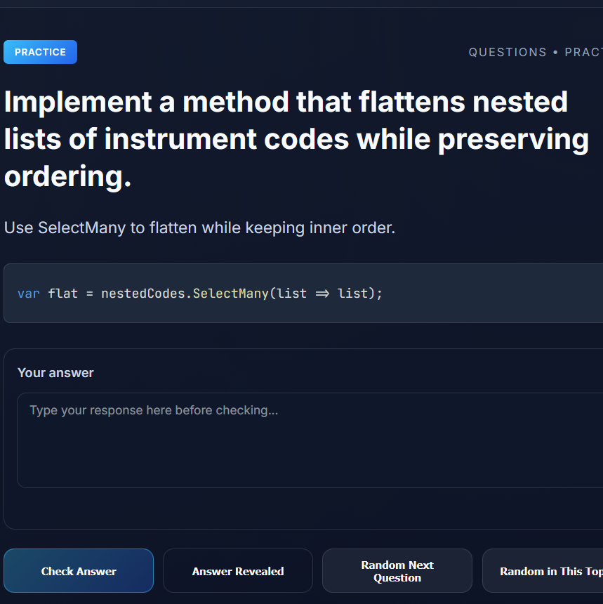

# Senior .NET Study Exercises

A focused practice site for senior-level C# and .NET study exercises. Use the sidebar to pick a topic, answer out loud, then check or reveal the reference answer.



https://senior-dot-net-study-exercises.dloizides.com

## Features

- 🧠 **Practice-first flow** – questions are answered manually, no auto-rotation
- 🗂️ **Topic navigation** – sidebar dropdowns for each practice topic
- ✅ **Check answer** – compare your response to the reference answer
- 👀 **Reveal answer** – show the full reference answer and code snippets
- 📱 **Responsive layout** – works on desktop and mobile

## Data Generation

Practice data is generated from the repository's `practice/` folder only:

```bash
# Generate practice Q&A data from practice/ folder
npm run build

# Or use Node directly
node build.js
```

This creates `data.js` containing:
- Question/answer pairs
- Topic metadata derived from filenames
- Source file references

## File Structure

```
exercise-web-site/
├── build.js           # Generator script - extracts Q&A from practice/
├── data.js            # Auto-generated practice data (created by build.js)
├── index.html         # Main app page
├── script.js          # Manual practice flow + topic navigation
├── styles.css         # Layout, sidebar, and code block styling
├── service-worker.js  # Offline support
├── manifest.json      # PWA manifest (JSON)
└── manifest.webmanifest # PWA manifest (webmanifest)
```

## Getting Started

1. **Generate practice data** from your practice notes:
   ```bash
   npm install
   npm run build
   ```

2. **Launch a local web server** and open `index.html`:
   ```bash
   npx serve .
   # or
   npx http-server .
   ```

3. **Practice intentionally** – choose a topic, answer, then check yourself.

## Customization

### Add New Practice Questions

Add Q&A pairs to any file in `../practice/`:

```markdown
**Q: What is the Single Responsibility Principle?**

A: A class should have one and only one reason to change.
```

Then rebuild:

```bash
npm run build
```

## Deployment

The site is optimized for static hosting:

```bash
# Build the practice data
npm run build

# Deploy the entire exercise-web-site/ folder to:
# - Netlify, Vercel, GitHub Pages
# - Any CDN or object storage (S3, Azure Blob, etc.)
```

Update `sitemap.xml` and `robots.txt` when publishing to production.

## Development Workflow

```bash
# 1. Update practice notes in ../practice/
# 2. Regenerate data
npm run build

# 3. Test locally
npx serve .
```

## Integration with the Study Portal

This practice site complements the other generated outputs:

- **Study Site** – full documentation with navigation and search
- **Flash Cards** – auto-rotating review format
- **Practice Q&A** – manual, topic-driven exercise review

## Quick Build Script

Use the PowerShell script to build all sites at once:

```powershell
.\build-all.ps1
```

## License

This project is licensed under the [MIT License](LICENSE).
