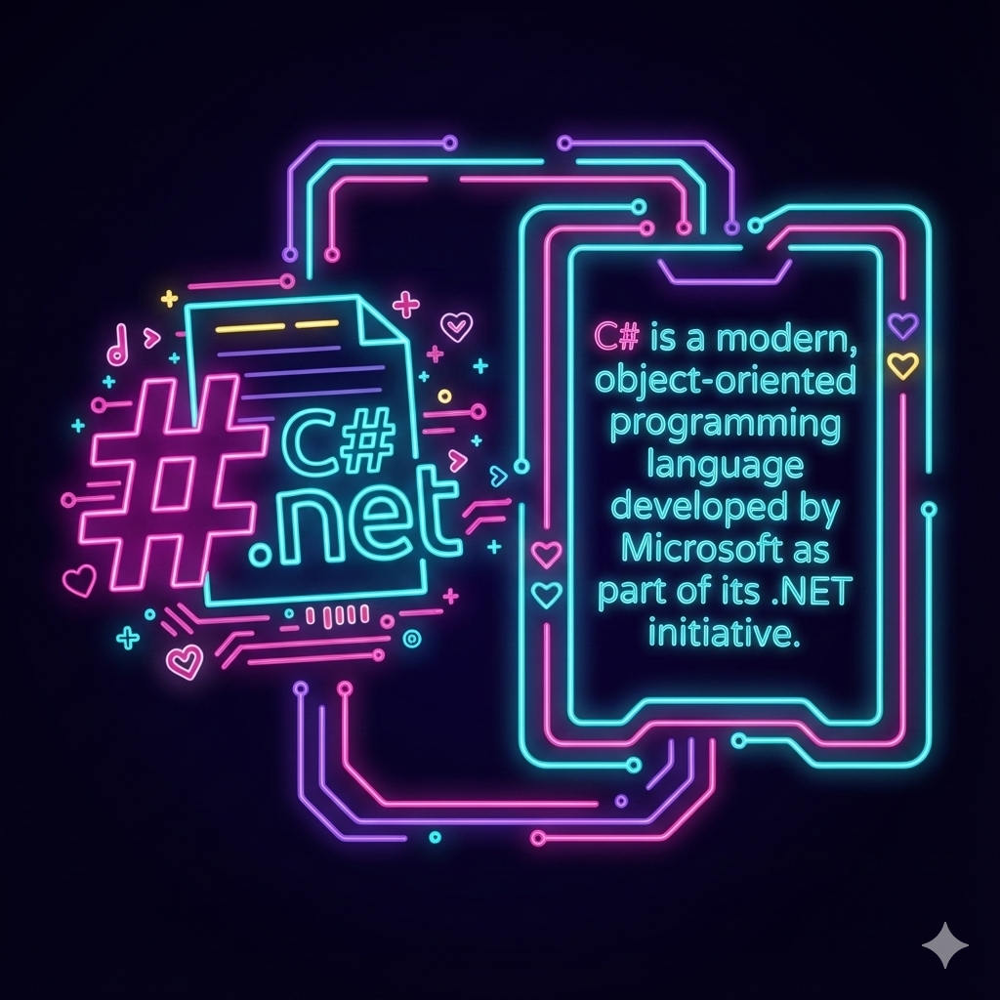

# C# Interview Prep Flash Cards

An immersive flash card experience that presents C# interview questions, answers, and code examples in a contemplative, auto-rotating format. Questions and code snippets fade in and out, helping you internalize key concepts through spaced repetition.



## Features

- 🎴 **Auto-generated content** – flash cards are automatically extracted from the `notes/` and `practice/` folders
- 💡 **Q&A format** – question and answer pairs from comprehensive study notes
- 💻 **Code examples** – displays good and bad code practices with syntax highlighting
- 🔄 **Auto-rotation** – cards fade in and out automatically for passive learning
- ♿ **Accessible design** – carefully crafted typography for extended study sessions
- 📱 **Progressive web app** – offline-ready with service worker support

## How It Works

The flash card system automatically processes your study materials:

1. **Extracts Q&A pairs** from markdown files marked with `**Q: question**` and `A: answer`
2. **Captures code examples** tagged with ❌ (bad example) or ✅ (good example)
3. **Organizes by topic** based on folder structure (SOLID, Design Patterns, etc.)
4. **Generates flash cards** with questions, answers, and formatted code blocks

## Data Generation

Flash card data is auto-generated from the repository's study materials:

```bash
# Generate flash cards from notes/ and practice/ folders
npm run build

# Or use Node directly
node build.js
```

This creates `flash-card-data.js` containing:
- Question/answer pairs from Q&A sections
- Code examples (good vs bad practices)
- Category and topic metadata
- Source file references

## File Structure

```
flash-card-web-site/
├── build.js              # Generator script - extracts Q&A and code from markdown
├── flash-card-data.js    # Auto-generated flash card data (created by build.js)
├── index.html            # Main app page
├── script.js             # Flash card rotation logic with code support
├── styles.css            # Styling with code block formatting
├── service-worker.js     # Offline support
└── manifest.json         # PWA manifest
```

## Getting Started

1. **Generate flash cards** from your study notes:
   ```bash
   npm install
   npm run build
   ```

2. **Launch a local web server** and open `index.html`:
   ```bash
   npx serve .
   # or
   npx http-server .
   ```

3. **Watch the flash cards rotate** – questions, answers, and code examples will fade in and out automatically

## Customization

### Adjusting Rotation Speed

Edit `script.js` to change timing:

```javascript
const displayDuration = 8000;      // Time card stays visible (ms)
const transitionDuration = 600;    // Fade transition duration (ms)
```

### Modifying Content

Flash cards are auto-generated from:
- `../notes/` – Study notes with Q&A sections
- `../practice/` – Practice questions and examples

Add new Q&A pairs to your markdown files:

```markdown
**Q: What is the Single Responsibility Principle?**

A: A class should have one and only one reason to change.
```

Add code examples with indicators:

```markdown
### ❌ Bad example:
\`\`\`csharp
// bad code here
\`\`\`

### ✅ Good example:
\`\`\`csharp
// good code here
\`\`\`
```

Then rebuild:

```bash
npm run build
```

## Deployment

The site is optimized for static hosting:

```bash
# Build the flash card data
npm run build

# Deploy the entire flash-card-web-site/ folder to:
# - Netlify, Vercel, GitHub Pages
# - Any CDN or object storage (S3, Azure Blob, etc.)
```

Update `sitemap.xml` and `robots.txt` when publishing to production.

## Development Workflow

```bash
# 1. Update study notes in ../notes/ or ../practice/
# 2. Regenerate flash cards
npm run build

# 3. Test locally
npx serve .

# 4. Review the generated flash-card-data.js to verify extraction
```

## Integration with Study Portal

This flash card system complements the [study-site](../study-site) static site generator:

- **Study Site** – Full documentation with navigation and search
- **Flash Cards** – Quick review format for spaced repetition

Both are generated from the same `notes/` and `practice/` source folders.

## Quick Build Script

Use the PowerShell script to build both sites at once:

```powershell
# From repository root
.\build-all.ps1
```

This runs:
1. Study site generator (`study-site/build.js`)
2. Flash card generator (`flash-card-web-site/build.js`)

## Contributing

Contributions that improve extraction logic, enhance code display, or refine the learning experience are welcome:

- Open an issue with your idea
- Submit a pull request with:
  - Clear description of changes
  - Screenshots for visual updates
  - Updated documentation

## License

This project is licensed under the [MIT License](LICENSE).
