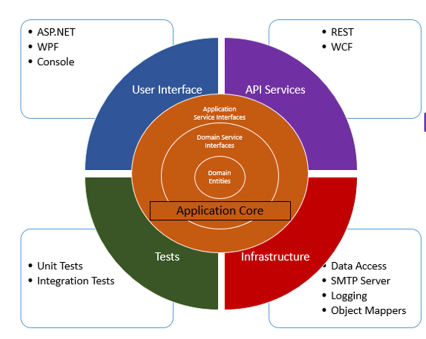

# 🧱 3️⃣ Clean Architecture — Layered Design for Trading Systems



Clean Architecture (from Uncle Bob) organizes your system into **layers** that isolate business logic from infrastructure.

---

### 🏗️ Layers Overview

```
┌───────────────────────────────┐
│       Presentation Layer      │ → Controllers, APIs, UI
├───────────────────────────────┤
│     Application Layer         │ → Use cases, CQRS handlers, services
├───────────────────────────────┤
│       Domain Layer            │ → Entities, Aggregates, Value Objects
├───────────────────────────────┤
│   Infrastructure Layer        │ → DBs, APIs, MT4/MT5, message brokers
└───────────────────────────────┘
```

---

### Example in a Trading Context

#### 🧩 Domain Layer

```csharp
public class Order
{
    public Guid Id { get; } = Guid.NewGuid();
    public string Symbol { get; set; }
    public double Amount { get; set; }
}
```

#### 🧩 Application Layer

```csharp
public class PlaceOrderHandler
{
    private readonly ITradeExecutor _executor;
    private readonly IOrderValidator _validator;

    public PlaceOrderHandler(ITradeExecutor executor, IOrderValidator validator)
    {
        _executor = executor;
        _validator = validator;
    }

    public void Handle(Order order)
    {
        if (!_validator.Validate(order))
            throw new InvalidOperationException("Invalid order");
        _executor.Execute(order);
    }
}
```

#### 🧩 Infrastructure Layer

```csharp
public class Mt5Executor : ITradeExecutor
{
    public void Execute(Order order) => Console.WriteLine($"[MT5] Executing {order.Symbol}");
}
```

#### 🧩 Presentation Layer

```csharp
[ApiController]
[Route("api/[controller]")]
public class OrdersController : ControllerBase
{
    private readonly PlaceOrderHandler _handler;
    public OrdersController(PlaceOrderHandler handler) => _handler = handler;

    [HttpPost]
    public IActionResult Post(Order order)
    {
        _handler.Handle(order);
        return Ok("Order executed");
    }
}
```

---

### ⚙️ How it all connects

* **Domain layer** = pure business rules
* **Application layer** = orchestration and use cases
* **Infrastructure** = implementation details (DBs, APIs, message buses)
* **Presentation** = web, console, or UI

> “Dependencies always point inward — nothing in domain depends on outer layers.”

This separation makes your system **testable, extensible, and resilient to change**.

---
