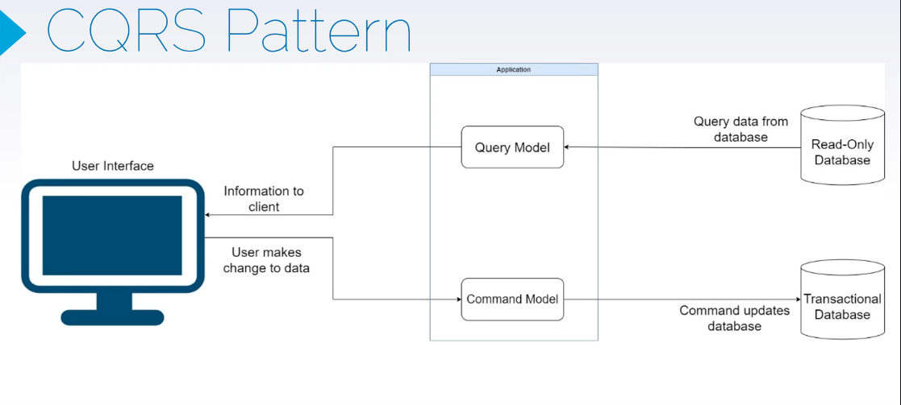

# ⚙️ 4️⃣ CQRS Pattern — *Command/Query split for trading operations*

> Separate **commands** (change system state) from **queries** (read state).

---

### 🧩 Example — PlaceOrder (Command) vs GetOrder (Query)

```csharp
public record PlaceOrderCommand(string Symbol, double Amount);
public record GetOrderQuery(Guid OrderId);

public class Order
{
    public Guid Id { get; set; } = Guid.NewGuid();
    public string Symbol { get; set; }
    public double Amount { get; set; }
}

public class OrderCommandHandler
{
    private readonly ITradeExecutor _executor;

    public OrderCommandHandler(ITradeExecutor executor) => _executor = executor;

    public void Handle(PlaceOrderCommand command)
    {
        var order = new Order { Symbol = command.Symbol, Amount = command.Amount };
        _executor.Execute(order);
    }
}

public class OrderQueryHandler
{
    private readonly Dictionary<Guid, Order> _orders = new();

    public Order Handle(GetOrderQuery query)
        => _orders.TryGetValue(query.OrderId, out var order)
            ? order
            : throw new KeyNotFoundException("Order not found");
}

// --- Usage ---
var executor = new Mt5Executor();
var commandHandler = new OrderCommandHandler(executor);
commandHandler.Handle(new PlaceOrderCommand("EURUSD", 1000));

var queryHandler = new OrderQueryHandler();
// queryHandler.Handle(new GetOrderQuery(...));
```

✅ **Why it matters:**

* Commands → mutate state (place/cancel order).
* Queries → fetch data (get portfolio, prices).
* Enables **scalability** (separate read/write services) and **event sourcing** (audit trading actions).

---

## Questions & Answers

**Q: Why split commands and queries in a trading platform?**

A: It allows optimizing writes (placing trades, cancelling orders) separately from reads (dashboards, risk reports). Each side scales independently, and commands can enforce invariants while queries use denormalized projections for speed.

**Q: How does CQRS relate to MediatR in .NET?**

A: MediatR naturally models CQRS—commands and queries implement `IRequest<T>` handled by dedicated handlers. Pipeline behaviors add validation, logging, or retries without mixing concerns.

**Q: Do commands ever return values?**

A: Prefer returning void or minimal identifiers, encouraging clients to query for the latest state separately. This keeps commands focused on side effects and simplifies testing.

**Q: How do you keep read models updated?**

A: Use domain events or the outbox pattern to publish changes that projection handlers consume. They update materialized views, caches, or search indexes asynchronously.

**Q: How does CQRS enable event sourcing?**

A: Commands append events to a store. Queries rebuild state or read from projections fed by those events. This provides a complete audit trail for compliance-heavy domains.

**Q: When is CQRS overkill?**

A: For small services with simple CRUD needs, splitting handlers adds complexity. Start simple and adopt CQRS when read/write workloads diverge or when you need auditability and segregation.

**Q: How do you enforce validation and authorization?**

A: Apply behaviors or decorators on the command pipeline to run validators and authorization checks pre-handler. Queries can apply read-specific policies separately.

**Q: How does CQRS aid scaling databases?**

A: Commands can target a write-optimized store (e.g., SQL with strict constraints) while queries hit read replicas or NoSQL caches tuned for fast lookups. This reduces contention and lock waits.

**Q: How do you test CQRS handlers?**

A: Unit test commands with mocked dependencies to assert events or repository calls. Integration test queries against seed data or projections to ensure mapping and filtering work as expected.

**Q: How do you handle consistency between reads and writes?**

A: Accept eventual consistency for views, communicate lag expectations, and provide read-your-writes mechanisms when necessary (e.g., direct query fallback or wait-for-projection acknowledgments).
