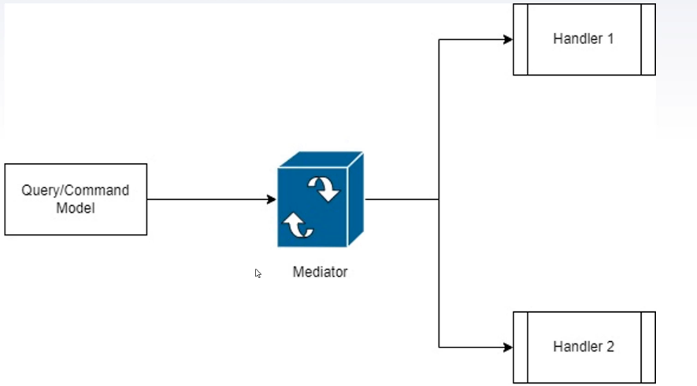

# ⚙️ 2️⃣ Mediator Pattern — *Decouple components by introducing a controller* 



> Define an object that encapsulates how a set of objects interact. The mediator promotes loose coupling by keeping objects from referring to each other explicitly.

---

### 🧩 Example — Mediator coordinating order validation, risk and execution

```csharp
public interface ITradeMediator
{
    void Notify(object sender, string ev, Order order);
}

public class TradeMediator : ITradeMediator
{
    private readonly OrderValidator _validator;
    private readonly RiskService _risk;
    private readonly TradeExecutor _executor;

    public TradeMediator(OrderValidator validator, RiskService risk, TradeExecutor executor)
    {
        _validator = validator;
        _risk = risk;
        _executor = executor;
    }

    public void Notify(object sender, string ev, Order order)
    {
        if (ev == "PlaceOrder")
        {
            if (!_validator.Validate(order))
            {
                Console.WriteLine("Validation failed");
                return;
            }

            if (!_risk.Check(order))
            {
                Console.WriteLine("Risk check failed");
                return;
            }

            _executor.Execute(order);
        }
    }
}

public class OrderValidator
{
    private readonly ITradeMediator _mediator;
    public OrderValidator(ITradeMediator mediator) => _mediator = mediator;
    public bool Validate(Order order) => order != null && order.Amount > 0;
}

public class RiskService
{
    private readonly ITradeMediator _mediator;
    public RiskService(ITradeMediator mediator) => _mediator = mediator;
    public bool Check(Order order) => order.Amount <= 100000; // simple rule
}

public class TradeExecutor
{
    private readonly ITradeMediator _mediator;
    public TradeExecutor(ITradeMediator mediator) => _mediator = mediator;
    public void Execute(Order order) => Console.WriteLine($"Executed {order.Id} for {order.Amount}");
}

// --- Usage ---
// Compose mediator with concrete components
// var mediator = new TradeMediator(new OrderValidator(null), new RiskService(null), new TradeExecutor(null));
// Wire mediator into components and use mediator.Notify(this, "PlaceOrder", order);
```

✅ **Why it matters:**

* Centralizes interaction logic between components (validation, risk, execution).
* Reduces direct dependencies between components, improving testability and maintainability.
* Makes it easier to change coordination rules without touching each component.

---
