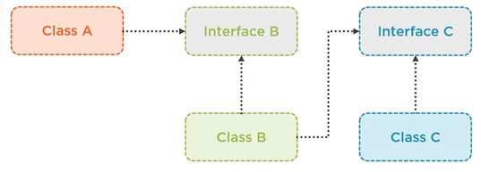

## **D — Dependency Inversion Principle (DIP)**



> “High-level modules should not depend on low-level modules. Both should depend on abstractions. Abstractions should not depend on details. Details should depend on abstractions.”

The Dependency Inversion Principle shifts coupling away from concrete implementations toward stable abstractions (interfaces or abstract classes). This reduces the ripple effect when implementation details change and makes code easier to test and extend.

### ❌ Bad example (high-level depends on low-level concrete types)

```csharp
public class SqlOrderRepository
{
	public void Save(Order order) { /* writes to SQL */ }
}

public class OrderService
{
	private readonly SqlOrderRepository _repo;
	public OrderService() { _repo = new SqlOrderRepository(); }

	public void PlaceOrder(Order order)
	{
		// business logic
		_repo.Save(order);
	}
}
```

Problems: `OrderService` is tightly coupled to `SqlOrderRepository`. You cannot easily replace persistence (e.g., with an in-memory repo for tests or a different database) without changing `OrderService`.

### ✅ Good example (depend on abstractions — constructor injection)

```csharp
public interface IOrderRepository { void Save(Order order); }

public class SqlOrderRepository : IOrderRepository
{
	public void Save(Order order) { /* writes to SQL */ }
}

public class OrderService
{
	private readonly IOrderRepository _repo;
	public OrderService(IOrderRepository repo) => _repo = repo;

	public void PlaceOrder(Order order)
	{
		// business logic
		_repo.Save(order);
	}
}
```

Now `OrderService` depends only on `IOrderRepository`. You can provide any implementation (SQL, NoSQL, mock) without changing `OrderService`.

### Notes on usage and patterns
- **Prefer constructor injection** for mandatory dependencies — it makes required collaborators explicit and easy to test.
- **Use interfaces or abstract base classes** to define stable contracts for behavior. Keep these contracts small and focused.
- **Inversion of Control (IoC) / DI containers** can wire concrete implementations to abstractions at composition root, keeping production wiring out of business classes.
- **Avoid service-locators** embedded inside classes — they hide dependencies and complicate testing.

### DIP benefits
- Decouples high-level policy from low-level details.
- Makes unit testing trivial by allowing replacement with fakes/mocks.
- Improves flexibility to change implementations (datastores, external APIs) without touching business code.

---

## Questions & Answers

**Q: How does DIP differ from simple dependency injection?**

A: DIP is the principle (depend on abstractions). Dependency injection is a technique to supply those abstractions at runtime. You can inject dependencies manually or via a container, but DIP guides the design.

**Q: What is the composition root, and why is it important?**

A: It’s the startup/wiring area where concrete implementations are composed. Keeping all bindings there ensures the rest of the system depends only on abstractions, honoring DIP.

**Q: How does DIP help with testing?**

A: You can swap real implementations with mocks/stubs when classes depend on interfaces. Tests instantiate high-level modules with fake collaborators, keeping them fast and deterministic.

**Q: When should you avoid introducing an interface?**

A: If there’s only one implementation with no foreseeable variation, an interface may add noise. Start with concrete classes and extract interfaces when change pressure or testing needs arise.

**Q: How does DIP interact with plug-in architectures?**

A: Plugins implement shared abstractions and register themselves. The host app depends only on the abstraction, so new plugins drop in without code changes.

**Q: How do you keep abstractions stable?**

A: Define them in higher-level projects (Domain/Application) and keep them small. Avoid leaking infrastructure concerns (SQL-specific types) into the interface.

**Q: What’s wrong with service locators?**

A: They invert control but hide dependencies, making testing harder and violating SRP. Constructor injection makes dependencies explicit and honors DIP.

**Q: How do you manage lifetimes when using DIP?**

A: Use DI containers to manage transient/scoped/singleton lifetimes. Ensure high-level modules don’t own disposal of low-level resources—they rely on the container/composition root.

**Q: How does DIP help with feature toggles?**

A: You can register different implementations based on configuration (e.g., mock gateway vs real) without touching consuming code.

**Q: How do you enforce DIP in architecture?**

A: Use project references to ensure inner layers define interfaces while outer layers implement them. Architecture tests (NetArchTest) can verify that domain projects don’t depend on infrastructure assemblies.

